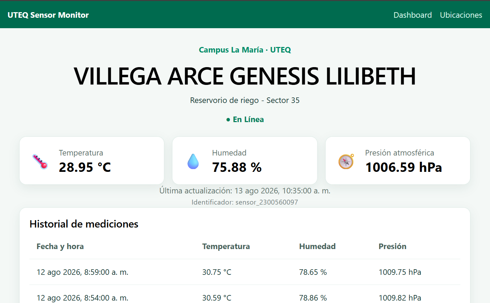

🌤️ Estación Meteorológica IoT - Monitoreo en Tiempo Real (UTEQ)

Este proyecto es una aplicación web de monitoreo ambiental IoT diseñada para visualizar en tiempo real variables meteorológicas (temperatura, humedad y presión atmosférica) recolectadas desde nodos de sensores distribuidos en el Campus "La María" de la Universidad Técnica Estatal de Quevedo. Utiliza una arquitectura moderna basada en React y Vite conectada a Firebase Realtime Database mediante suscripciones reactivas para actualización instantánea.

🚀 Tecnologías Utilizadas

* Base de Datos / Backend: Firebase Realtime Database (NoSQL en tiempo real).
* Frontend: React + Vite.
* Enrutamiento: React Router DOM (v6).
* Estilos: CSS3 Nativo (Grid Layout / Flexbox).
* Control de Versiones: Git + GitHub.

📌 Características del Proyecto

* Sincronización en Tiempo Real: Actualización inmediata de métricas sin necesidad de recargar la página gracias al SDK de Firebase (`onValue`).
* Directorio de Ubicaciones: Consulta interactiva de sensores registrados por zona dentro del Campus La María, coordenadas geográficas y estado operativo.
* Dashboard Dinámico: Rutas independientes por sensor (`/sensor/:sensorId`) para la inspección detallada de cada estación.
* Métricas KPI e Histórico: Tarjetas de indicadores clave para la última lectura registrada y tabla cronológica con el historial de mediciones.
* Diseño Responsivo: Interfaz adaptativa optimizada para dispositivos móviles, tabletas y computadoras de escritorio.
